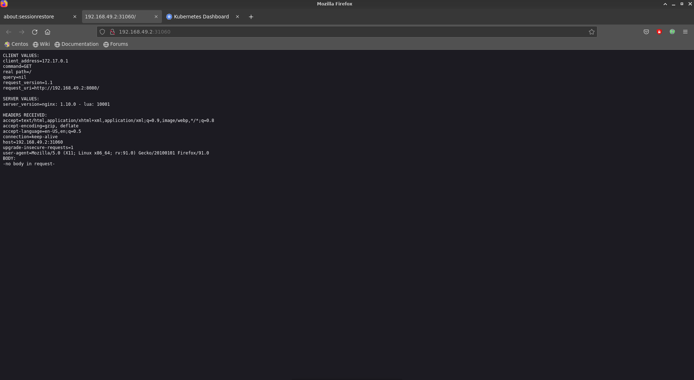
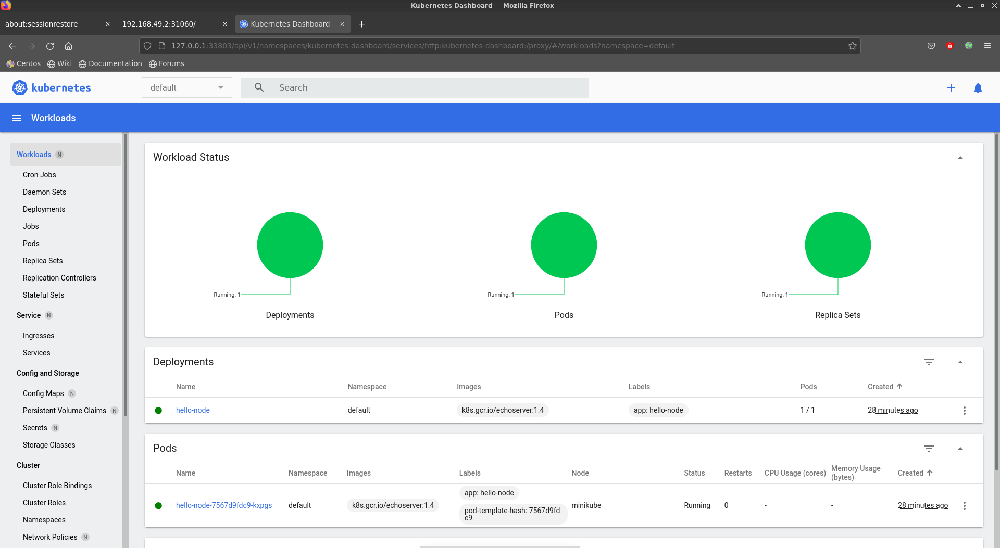

Устанавливаю minikube с помощью [роли](https://github.com/ottvladimir/12-kubernetes-adm/blob/master/12-kubernetes-01-intro/requirements.yml) 

```bash
$ ansible-galaxy install -r requirements.yml 
- extracting minikube to /home/vladimir/.ansible/roles/minikube
- minikube was installed successfully
```
```bash
# ansible-playbook playbook.yml  -i inventory.yml -l local
[WARNING]: Found both group and host with same name: minikube

PLAY [Install minikube] **********************************************************************************************************************************************************************

TASK [Gathering Facts] ***********************************************************************************************************************************************************************
ok: [local]

TASK [minikube : create download directory] **************************************************************************************************************************************************
ok: [local]

TASK [minikube : download Minikube] **********************************************************************************************************************************************************
ok: [local]

TASK [minikube : install Minikube] ***********************************************************************************************************************************************************
ok: [local]

TASK [minikube : download Kubectl] ***********************************************************************************************************************************************************
ok: [local]

TASK [minikube : install Kubectl] ************************************************************************************************************************************************************
ok: [local]

PLAY RECAP ***********************************************************************************************************************************************************************************
local                      : ok=6    changed=0    unreachable=0    failed=0    skipped=0    rescued=0    ignored=0 
```

```bash
$ minikube start
😄  minikube v1.23.2 on Centos 8.4.2105
✨  Automatically selected the docker driver
👍  Starting control plane node minikube in cluster minikube
🚜  Pulling base image ...
🔥  Creating docker container (CPUs=2, Memory=4900MB) ...
🐳  Preparing Kubernetes v1.22.2 on Docker 20.10.8 ...
    ▪ Generating certificates and keys ...
    ▪ Booting up control plane ...
    ▪ Configuring RBAC rules ...
🔎  Verifying Kubernetes components...
    ▪ Using image gcr.io/k8s-minikube/storage-provisioner:v5
🌟  Enabled addons: storage-provisioner, default-storageclass
🏄  Done! kubectl is now configured to use "minikube" cluster and "default" namespace by default
```

Включаю ingress, dashboard 
```bash 
$ minikube addons enable ingress
    ▪ Using image k8s.gcr.io/ingress-nginx/controller:v1.0.0-beta.3
    ▪ Using image k8s.gcr.io/ingress-nginx/kube-webhook-certgen:v1.0
    ▪ Using image k8s.gcr.io/ingress-nginx/kube-webhook-certgen:v1.0
🔎  Verifying ingress addon...
🌟  The 'ingress' addon is enabled
[vladimir@mycentos minikube_role_ans]$ minikube addons enable dashboard
    ▪ Using image kubernetesui/dashboard:v2.3.1
    ▪ Using image kubernetesui/metrics-scraper:v1.0.7
💡  Some dashboard features require the metrics-server addon. To enable all features please run:

	minikube addons enable metrics-server	


🌟  The 'dashboard' addon is enabled
[vladimir@mycentos minikube_role_ans]$ minikube addons enable metrics-server
    ▪ Using image k8s.gcr.io/metrics-server/metrics-server:v0.4.2
🌟  The 'metrics-server' addon is enabled
```
Стартую Hello, minikube
```bash
$ kubectl create deployment hello-node --image=k8s.gcr.io/echoserver:1.4
deployment.apps/hello-node created
```
```bash
$ kubectl get deployments
NAME         READY   UP-TO-DATE   AVAILABLE   AGE
hello-node   1/1     1            1           53s
$ kubectl get pods
NAME                          READY   STATUS    RESTARTS   AGE
hello-node-7567d9fdc9-kxpgs   1/1     Running   0          3m5s
$ kubectl expose deployment hello-node --type=LoadBalancer --port=8080
service/hello-node exposed
$ kubectl get services
NAME         TYPE           CLUSTER-IP       EXTERNAL-IP   PORT(S)          AGE
hello-node   LoadBalancer   10.100.246.196   <pending>     8080:31060/TCP   9s
kubernetes   ClusterIP      10.96.0.1        <none>        443/TCP          10m
$ minikube service hello-node
|-----------|------------|-------------|---------------------------|
| NAMESPACE |    NAME    | TARGET PORT |            URL            |
|-----------|------------|-------------|---------------------------|
| default   | hello-node |        8080 | http://192.168.49.2:31060 |
|-----------|------------|-------------|---------------------------|
🎉  Opening service default/hello-node in default browser...
```
Запущенный Hello, minikube



Запущенный dashboard


